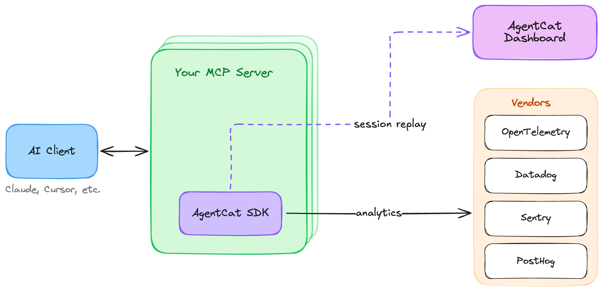

<div align="center">
  
</div>
<h3 align="center">
    <a href="#getting-started">Getting Started</a>
    <span> · </span>
    <a href="#why-use-agentcat-">Features</a>
    <span> · </span>
    <a href="https://docs.agentcat.com">Docs</a>
    <span> · </span>
    <a href="https://agentcat.com">Website</a>
    <span> · </span>
    <a href="#free-for-open-source">Open Source</a>
    <span> · </span>
    <a href="https://meet.agentcat.com/meet">Schedule a Demo</a>
</h3>
<p align="center">
  <a href="https://badge.fury.io/js/agentcat"></a>
  <a href="https://www.npmjs.com/package/agentcat"></a>
  <a href="https://opensource.org/licenses/MIT"></a>
  <a href="https://www.typescriptlang.org/"></a>
  <a href="https://github.com/agentcathq/agentcat-typescript-sdk/issues"></a>
  <a href="https://github.com/agentcathq/agentcat-typescript-sdk/actions"></a>
</p>

> [!IMPORTANT]
> **MCPcat is now AgentCat** 🐱 — same team, same product, new name. This package was previously published as [`mcpcat`](https://www.npmjs.com/package/mcpcat), which keeps working forever, but new features land here. Upgrading takes a few minutes — see the [migration guide](./MIGRATION.md).

> [!NOTE]
> Looking for the Python SDK? Check it out here [agentcat-python](https://github.com/agentcathq/agentcat-python-sdk).

AgentCat is an analytics platform for MCP server owners 🐱. It captures user intentions and behavior patterns to help you understand what AI users actually need from your tools — eliminating guesswork and accelerating product development all with one-line of code.

This SDK also provides a free and simple way to forward telemetry like logs, traces, and errors to any Open Telemetry collector or popular tools like Datadog, Sentry, and PostHog.

```bash
npm install -S agentcat
```

To learn more about us, check us out [here](https://agentcat.com). For detailed guides visit our [documentation](https://docs.agentcat.com).

## Why use AgentCat? 🤔

AgentCat helps developers and product owners build, improve, and monitor their MCP servers by capturing user analytics and tracing tool calls.

Use AgentCat for:

- **User session replay** 🎬. Follow alongside your users to understand why they're using your MCP servers, what functionality you're missing, and what clients they're coming from.
- **Trace debugging** 🔍. See where your users are getting stuck, track and find when LLMs get confused by your API, and debug sessions across all deployments of your MCP server.
- **Existing platform support** 📊. Get logging and tracing out of the box for your existing observability platforms (OpenTelemetry, Datadog, Sentry) — eliminating the tedious work of implementing telemetry yourself.



## Getting Started

To get started with AgentCat, first create an account and obtain your project ID by signing up at [agentcat.com](https://agentcat.com). For detailed setup instructions visit our [documentation](https://docs.agentcat.com).

Once you have your project ID, integrate AgentCat into your MCP server:

```ts
import * as agentcat from "agentcat";

const mcpServer = new Server({ name: "echo-mcp", version: "0.1.0" });

// Track the server with AgentCat
agentcat.track(mcpServer, "proj_0000000");

// Register your tools
```

### Identifying users

You can identify the actor behind each request with a simple callback AgentCat exposes, called `identify`.

```ts
agentcat.track(mcpServer, "proj_0000000", {
  identify: async (request, extra) => {
    const user = await myapi.getUser(request.params.arguments.token);
    return {
      userId: user.id,
      userName: user.name,
      userData: { favoriteColor: user.favoriteColor },
    };
  },
});
```

`identify` runs on **every tool call**, and what it returns is stamped on that
call's event and nothing else. Nothing is cached or merged between calls, so
return the complete `userData` object each time — a partial object will not be
combined with what you returned earlier. Returning `null` (or throwing) leaves
that event anonymous.

### Task and agent handles

MCP 2026-07-28 ([SEP-2567](https://modelcontextprotocol.io)) removed
protocol-level sessions, so there is no transport identifier left to correlate
tool calls with. AgentCat instead asks the agent for two explicit handles, both
injected into your tools' schemas as **optional** string parameters:

| Parameter  | Scope                                                                     | Lands in                                  |
| ---------- | ------------------------------------------------------------------------- | ----------------------------------------- |
| `task_id`  | One goal from start to finish. Subagents reuse the **same** `task_id`.    | `Event.sessionId` (still `ses_`-prefixed) |
| `agent_id` | One per agent. A freshly spawned subagent **omits** it and is issued one. | the `agentcat_agent_id` tag               |

The protocol is _omit, then echo_:

1. On its first call the agent omits the handles.
2. The server mints them and appends an `[MCP INSTRUCTIONS]:` text block to the
   tool result telling the agent which values to reuse.
3. The agent echoes those exact values on every later call, and passes `task_id`
   (never `agent_id`) to any subagent it spawns.

Nothing changes in your handler: AgentCat strips both parameters from the
arguments before your tool code runs, and the mint-back block is appended only
when something was actually minted — never to an error result, and never to a
result without an array `content` field.

Because `Event.sessionId` still carries a `ses_`-prefixed ID, a "session" in the
AgentCat dashboard is now one task, and existing saved views and queries keep
working.

Each tool-call event is also tagged with `agentcat_task_id_source`
(`hook` | `supplied` | `minted`) and, when agent tracking is on,
`agentcat_agent_id` plus `agentcat_agent_id_source` (`supplied` | `minted`).

#### Options

```ts
agentcat.track(mcpServer, "proj_0000000", {
  // Drop `agent_id` entirely — schemas, tags, and mint-back text. Default: true.
  enableAgentTracking: false,

  // Supply your own correlation ID instead. Takes precedence over the
  // agent-supplied `task_id`; return null (or throw) to fall back to it.
  resolveTaskId: (request, extra) => {
    const header = extra?.headers?.["x-workflow-id"];
    return typeof header === "string" ? header : null;
  },
});
```

`resolveTaskId` runs on every tool call and receives the same `(request, extra)`
arguments as `identify`. Whatever it returns is hashed together with your project
ID into a deterministic `ses_…` Task ID, so the same identifier always maps to
the same task. You will see that hashed `ses_…` in the dashboard, **not** the
string you returned — passing `"checkout-flow"` does not make `"checkout-flow"`
appear anywhere in the UI.

Handle injection is gated on `enableTracing`. With `enableTracing: false` no
handles are added to your schemas and none are read from incoming calls.

If one of your own tools already declares a `task_id` or `agent_id` parameter,
AgentCat leaves that tool alone — it will not inject, read, or strip the
parameter — and tags the resulting events with `agentcat_handle_collision`.

#### Custom events and handle conventions

`publishCustomEvent` has no request to read handles from, so you must pass the
Task ID yourself — as the first argument, or as `eventData.taskId`, which wins.
Custom events are **anonymous** unless you also supply `eventData.actor`.

```ts
await agentcat.publishCustomEvent(server, "proj_0000000", {
  taskId: "ses_2Zx...", // the handle the agent echoed back
  resourceName: "custom-action",
  actor: { userId: "user-123", userName: "Ada" },
});
```

The string is interpreted by prefix: a value starting with `ses_` is used
**verbatim**, and anything else is **derived** with the same hash `resolveTaskId`
uses. That one-bit heuristic is all a bare string carries, so two mixed
conventions do not correlate — and neither is fixable from the string alone:

- An agent-supplied `task_id` that is **not** `ses_`-prefixed is taken verbatim
  on a tool call (deliberately, so a caller can thread its own ID through), but
  the same string handed to `publishCustomEvent` gets derived.
- A `resolveTaskId` hook returning a **`ses_`-prefixed** value is derived (hook
  return values always are), but the same string handed to `publishCustomEvent`
  is used verbatim.

**Pick one convention and stay in it.** Either use the handles the agent gave you
— always `ses_`-prefixed, therefore verbatim everywhere — or always use your own
identifiers via `resolveTaskId` — never `ses_`-prefixed, therefore derived
everywhere. Do not mix.

#### ID prefixes

`AgentCatIDPrefixes` is exported as documentation of the ID scheme AgentCat
mints (`ses` for tasks, `agt` for agents, `evt` for events). It is a reference
constant with no internal consumers — the SDK hardcodes its own prefixes — so
you never need to pass it anywhere.

### Redacting sensitive data

AgentCat redacts all data sent to its servers and encrypts at rest, but for additional security, it offers a hook to do your own redaction on all text data returned back to our servers.

```ts
agentcat.track(mcpServer, "proj_0000000", {
  redactSensitiveInformation: async (text) => await redact(text),
  // or
  redactSensitiveInformation: (text) => redact(text),
});
```

For redaction decisions that need more context than a single string — such as which tool was called or what type of event is being published — use the event-level `redactEvent` hook. It receives the full event object and returns a modified event, or `null` to drop the event entirely. It may be sync or async, and can be combined with `redactSensitiveInformation`.

```ts
agentcat.track(mcpServer, "proj_0000000", {
  redactEvent: (event) => {
    // Drop events from tools that handle secrets entirely
    if (event.resourceName === "get_credentials") {
      return null;
    }
    // Strip response payloads from a specific tool
    if (event.resourceName === "export_report") {
      return { ...event, response: undefined };
    }
    return event;
  },
});
```

When both hooks are configured, `redactEvent` runs first and sees the raw, unredacted values; `redactSensitiveInformation` then runs on its output as a final string-level scrub. The system-managed fields `id`, `sessionId` (the Task ID — see [Task and agent handles](#task-and-agent-handles)), `projectId`, `eventType`, and `timestamp` cannot be changed by the hook, and if the hook throws, the event is dropped. The hook also applies to `publishCustomEvent` when called with a tracked server.

### Existing Platform Support

AgentCat seamlessly integrates with your existing observability stack, providing automatic logging and tracing without the tedious setup typically required. Export telemetry data to multiple platforms simultaneously:

```typescript
agentcat.track(server, "proj_0000", {
  // Project ID can optionally be "null" if you just want to forward telemetry
  exporters: {
    otlp: {
      type: "otlp",
      endpoint: "http://localhost:4318/v1/traces",
    },
    datadog: {
      type: "datadog",
      apiKey: process.env.DD_API_KEY,
      site: "datadoghq.com",
      service: "my-mcp-server",
    },
    sentry: {
      type: "sentry",
      dsn: process.env.SENTRY_DSN,
      environment: "production",
    },
    posthog: {
      type: "posthog",
      apiKey: process.env.POSTHOG_API_KEY,
      host: "https://us.i.posthog.com", // Optional: defaults to US region
    },
  },
});
```

Learn more about our free and open source [telemetry integrations](https://docs.agentcat.com/telemetry/integrations).

### Internal diagnostics

To help us catch and fix broken installs, the SDK sends AgentCat a small, anonymized
signal when setup or runtime errors occur — never your tool calls, your responses,
or anything about your users. Records carry only operational metadata, such as your
project ID (or an anonymous install ID when none is set). Your local `~/agentcat.log`
is unchanged.

Diagnostics are on by default and can be turned off completely with either:

- `track(server, projectId, { disableDiagnostics: true })`, or
- the `DISABLE_DIAGNOSTICS` environment variable.

## Free for open source

AgentCat is free for qualified open source projects. We believe in supporting the ecosystem that makes MCP possible. If you maintain an open source MCP server, you can access our full analytics platform at no cost.

**How to apply**: Email hi@agentcat.com with your repository link

_Already using AgentCat? We'll upgrade your account immediately._

## Community Cats 🐱

Meet the cats behind AgentCat! Add your cat to our community by submitting a PR with your cat's photo in the `docs/cats/` directory.

<div align="left">
  
  
</div>

_Want to add your cat? Create a PR adding your cat's photo to `docs/cats/` and update this section!_
